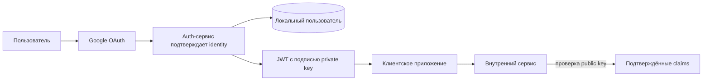

# ADR: выпуск собственного JWT

**Статус:** предложено, не реализовано.

## Контекст

После Google OAuth auth-сервис сейчас передаёт клиенту Google `id_token`.
Защищённые HTTP- и TCP-операции повторно проверяют этот токен через Google Auth
Library.

Такой контракт связывает внутренние сервисы с форматом и жизненным циклом
токена внешнего identity provider. Замена Google или изменение внутренней
модели авторизации потребует изменений у потребителей.

## Предложение

После подтверждения Google identity auth-сервис может выпускать собственный JWT
с асимметричной подписью:

Предполагаемый результат:

- внутренние сервисы не зависят от Google `id_token`;
- identity provider можно заменить без изменения токенного контракта
  потребителей;
- проверка подписи может выполняться без RPC-вызова auth-сервиса.

## Решения, необходимые до принятия

Необходимо определить:

- обязательные claims, `issuer` и `audience`;
- срок жизни access token и необходимость refresh token;
- хранение, публикацию и ротацию ключей;
- правила отзыва токенов и завершения сессий;
- способ доставки токена разным клиентским приложениям;
- миграцию существующего TCP-контракта `auth.user`;
- связь внешнего Google `sub` с внутренним идентификатором пользователя.

До принятия этих решений текущим контрактом остаётся Google `id_token`.
