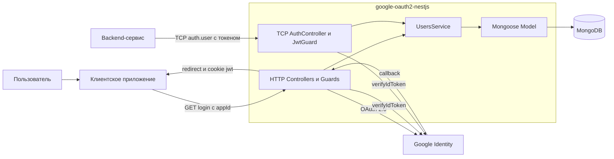

# Обзор архитектуры

## Роль сервиса

`google-oauth2-nestjs` — универсальный auth-сервис. Он отделяет интеграцию с
Google OAuth 2.0 и хранение identity от прикладной логики клиентских систем.

Роли участников интеграции:

- **клиентское приложение** инициирует вход через HTTP и принимает пользователя
  после успешного OAuth flow;
- **google-oauth2-nestjs** выполняет Google OAuth, хранит локальный профиль и
  подтверждает Google `id_token`;
- **защищённый backend-сервис** обращается к TCP-контракту `auth.user`, чтобы
  получить подтверждённого пользователя перед выполнением операции.



## Внешние интерфейсы

Сервис одновременно запускает:

- HTTP-сервер для браузерного OAuth flow, logout и профиля;
- TCP-микросервис для проверки пользователя внутренними сервисами;
- соединение Mongoose с MongoDB.

Google является identity provider и источником текущего `id_token`. Клиентские
приложения задаются JSON-картой `OAUTH_CLIENT_APPS` и не получают прямой доступ
к MongoDB.

## Внутренняя архитектура

HTTP flow:

```text
GoogleOauthController
→ GoogleOauthGuard / GoogleOauthStrategy
→ GoogleOauthService / UsersService
→ Mongoose Model
→ MongoDB
```

TCP flow:

```text
AuthController
→ JwtGuard
→ UsersService
→ Mongoose Model
→ MongoDB
```

- **Controllers** определяют HTTP routes и TCP message pattern.
- **Guards** запускают OAuth flow либо проверяют Google `id_token`.
- **GoogleOauthStrategy** преобразует Google profile в локального пользователя.
- **GoogleOauthService** устанавливает/удаляет cookie и выбирает redirect.
- **UsersService** создаёт и ищет документы через Mongoose model.
- **MongoDB** хранит локальные профили.

Отдельного repository-слоя нет: `UsersService` работает с Mongoose model
напрямую.

## Безопасность

- OAuth `state` подписывается отдельным секретом и действует пять минут;
- auth-cookie недоступна JavaScript, использует `SameSite=Lax` и в production
  передаётся только по HTTPS;
- Google `id_token` проверяется с `audience = CLIENT_ID`;
- HTTP и TCP используют один `JwtGuard` с разными источниками токена;
- собственные access/refresh tokens, ротация ключей и отзыв токенов пока не
  реализованы.

## Архитектурные решения

- [Предложение по выпуску собственного JWT](./adr/own-jwt.md).

Подробности операций находятся в
[системной спецификации](../system/system-specification.md), структура MongoDB —
в [модели данных](../system/data-model.md).
