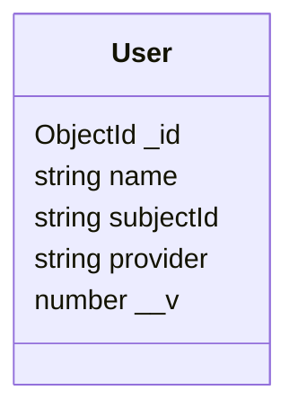

# Модель данных

## Назначение

Сервис хранит локальные профили пользователей в MongoDB через Mongoose.
Реляционной схемы и SQL-миграций в проекте нет.

## Модель пользователя

| Поле        | Назначение                              | Ограничения текущей схемы                          |
| ----------- | --------------------------------------- | -------------------------------------------------- |
| `_id`       | идентификатор MongoDB                   | создаётся MongoDB/Mongoose                         |
| `name`      | отображаемое имя из Google profile      | `required` не задан                                |
| `subjectId` | идентификатор пользователя у провайдера | `required` и `unique` не заданы                    |
| `provider`  | провайдер identity                      | допускается значение `google`, `required` не задан |
| `__v`       | версия документа Mongoose               | добавляется Mongoose                               |

В schema не включены `timestamps`, поэтому `createdAt` и `updatedAt`
автоматически не сохраняются.

## Операции с данными

- при callback пользователь ищется по паре `subjectId + provider`;
- если результат пуст, создаётся новый документ;
- для HTTP-профиля и TCP-контракта выполняется поиск только по `subjectId`;
- методы поиска возвращают массив документов;
- обновление и удаление пользователей не реализованы.

## Гарантии и ограничения

- явных индексов и уникальных ограничений в Mongoose schema нет;
- пара `subjectId + provider` может иметь несколько документов, особенно при
  параллельном первом входе;
- приложение использует первую запись при OAuth callback, но возвращает все
  совпадения при поиске по `subjectId`;
- enum ограничивает `provider` значением `google` на уровне Mongoose;
- схема не помечает бизнес-поля обязательными;
- структура коллекции изменяется вместе с кодом модели, отдельного migration
  workflow нет.

Ожидаемое бизнес-правило уникальности вынесено в
[открытые вопросы](../business/business-rules.md#открытые-вопросы).
