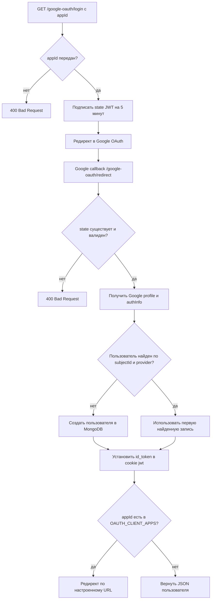
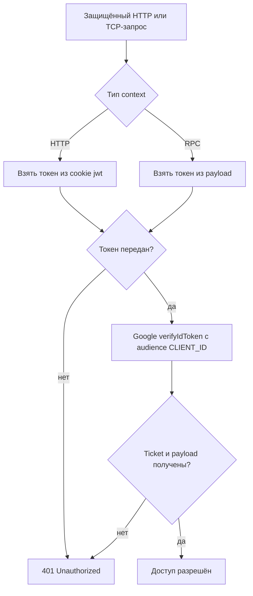

# Системная спецификация

## Назначение

Документ описывает текущие HTTP- и TCP-интерфейсы auth-сервиса, Google OAuth
flow, проверки, ошибки и результаты. Бизнес-смысл операций находится в
[бизнес-правилах](../business/business-rules.md).

По умолчанию HTTP-сервер слушает порт `3001`, TCP-микросервис — `3002`. У HTTP
API нет глобального префикса и версионирования. Swagger в приложении не
настроен.

## Сводка интерфейсов

### HTTP

| Метод и путь                         | Защита             | Успешный результат                                     |
| ------------------------------------ | ------------------ | ------------------------------------------------------ |
| `GET /google-oauth/login?appId=<id>` | Google OAuth guard | редирект в Google                                      |
| `GET /google-oauth/redirect`         | Google OAuth guard | редирект в клиентское приложение или JSON пользователя |
| `GET /google-oauth/logout`           | нет                | `200`, строка `Logged out`                             |
| `GET /users/profile`                 | `JwtGuard`         | `200`, массив локальных пользователей                  |

### TCP

| Message pattern | Защита     | Payload                    | Результат                                          |
| --------------- | ---------- | -------------------------- | -------------------------------------------------- |
| `auth.user`     | `JwtGuard` | строка с Google `id_token` | массив пользователей с соответствующим `subjectId` |

## Google OAuth flow

### Начало входа

`GET /google-oauth/login?appId=<client-app-id>`

1. `GoogleOauthGuard` требует непустой query-параметр `appId`.
2. Guard подписывает `state` через `JwtService` с секретом
   `OAUTH_STATE_SECRET` и сроком жизни пять минут.
3. Passport перенаправляет пользователя в Google со scope `profile` и
   `openid`.

Отсутствующий `appId` возвращает `400 Bad Request` с сообщением об отсутствии
идентификатора клиента.

### Callback Google

`GET /google-oauth/redirect`

1. Guard получает `state` из query и проверяет подпись и срок жизни.
2. Passport strategy получает Google profile и `authInfo`.
3. Пользователь ищется в MongoDB по `profile.id` и `profile.provider`.
4. Если массив результатов пуст, создаётся новая запись.
5. `id_token` из `authInfo` устанавливается в cookie `jwt`.
6. `OAUTH_CLIENT_APPS` разбирается как JSON-карта `appId → redirect URL`.
7. Для известного `appId` возвращается HTTP redirect, иначе — JSON локального
   пользователя.

Cookie имеет параметры `httpOnly: true`, `sameSite: lax`; `secure` включается
только при `NODE_ENV=production`. Срок жизни cookie явно не задаётся.

Ошибки:

| Ситуация                                                     | Результат                               |
| ------------------------------------------------------------ | --------------------------------------- |
| `state` отсутствует, повреждён или просрочен                 | `400 Bad Request`                       |
| Passport не вернул пользователя                              | `401 Unauthorized` либо ошибка Passport |
| В request отсутствует пользователь                           | `400 Bad Request`                       |
| В request отсутствует `authInfo`                             | `400 Bad Request`                       |
| `OAUTH_CLIENT_APPS` отсутствует или содержит невалидный JSON | `400 Bad Request`                       |

Неизвестный `appId` не считается ошибкой и приводит к JSON-ответу.

## Выход

`GET /google-oauth/logout`

Endpoint не защищён. Он удаляет cookie `jwt` и возвращает JSON-строку
`Logged out`. Токен у Google не отзывается, Google-сессия не завершается.

## Проверка токена

`JwtGuard` используется в HTTP и RPC context:

Если `verifyIdToken` выбрасывает стороннюю ошибку, guard её не нормализует.
Поэтому код явно гарантирует `401` только для отсутствующего токена, пустого
ticket или payload; статус ошибки Google library зависит от глобальной обработки
NestJS.

## Профиль пользователя

`GET /users/profile`

1. `JwtGuard` подтверждает Google `id_token` из cookie.
2. Controller декодирует claim `sub`.
3. `UsersService` возвращает массив документов с `subjectId = sub`.

Если локальный профиль отсутствует, возвращается пустой массив. Endpoint не
возвращает единственный объект и не проверяет уникальность результата.

## TCP-контракт `auth.user`

TCP-клиент отправляет токен строкой в payload сообщения `auth.user`.

1. `JwtGuard` проверяет payload как Google `id_token`.
2. Controller декодирует `sub`.
3. Возвращается массив локальных пользователей с таким `subjectId`.

Этот контракт используется внутренними сервисами для получения подтверждённого
пользователя. Пустой результат является допустимым ответом.

## Хранение пользователей

`GoogleOauthStrategy` и controllers обращаются к `UsersService`, который
использует Mongoose model напрямую. Отдельного repository-слоя и миграций нет.
Структура документа описана в [модели данных](./data-model.md).

## Текущие ограничения

- Swagger/OpenAPI отсутствует;
- DTO и глобальный `ValidationPipe` для HTTP API не настроены;
- уникальность Google identity не закреплена индексом;
- protected endpoints возвращают массив даже при поиске одного пользователя;
- тесты не покрывают реальный OAuth flow, MongoDB и TCP transport.
