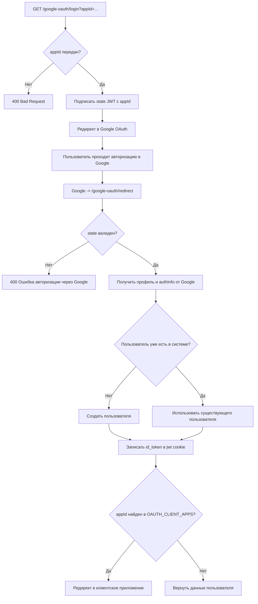
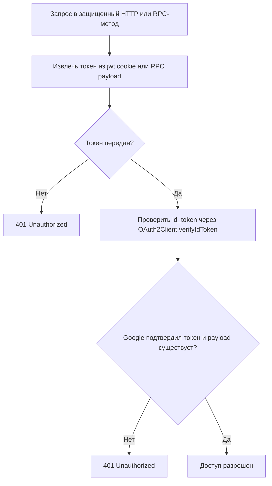

# 3. Бизнес-правила

## 3.1 Авторизация через Google OAuth 2.0

Предусловия:

- пользователь не авторизован
- в запросе на вход передан `appId`
- в Google Console зарегистрировано OAuth-приложение с callback URL `/google-oauth/redirect`
- в Google Console зарегистрирован origin, которому выдаются права

Алгоритм:

1. Клиентское приложение переводит пользователя на `GET /google-oauth/login?appId=<client-app-id>`.
2. Система проверяет, что в query-параметрах передан `appId`.
3. Если `appId` не передан, система возвращает `400 Bad Request`.
4. Если `appId` передан, `GoogleOauthGuard` подписывает short-lived `state` JWT c `appId` и инициирует редирект в Google OAuth.
5. Пользователь проходит аутентификацию в Google и подтверждает доступ приложению.
6. Google перенаправляет пользователя на `GET /google-oauth/redirect` с OAuth-данными и `state`.
7. `GoogleOauthGuard` проверяет `state`. Если токен отсутствует или невалиден, система возвращает `400 Bad Request`.
8. `GoogleOauthStrategy` получает профиль пользователя от Google и ищет пользователя по `profile.id` и `provider`.
9. Если пользователь уже существует, система использует существующую запись.
10. Если пользователь не найден, система создает нового пользователя.
11. После успешной проверки сервис получает `id_token` из `authInfo`, записывает его в `jwt` cookie и определяет конечный адрес редиректа по `appId`.
12. Если для `appId` найдено приложение в `OAUTH_CLIENT_APPS`, система делает редирект в это приложение.
13. Если приложение по `appId` не найдено, система возвращает данные пользователя в ответе.

Flow авторизации через Google OAuth (`GET /google-oauth/login` -> `GET /google-oauth/redirect`)

## 3.2 Проверка JWT на защищенных ручках

1. Пользователь отправляет запрос в защищенный HTTP-эндпоинт или RPC-метод.
2. `JwtGuard` извлекает токен:
   для HTTP-запроса - из `jwt` cookie,
   для RPC-запроса - из payload сообщения.
3. Если токен отсутствует, система возвращает `401 Unauthorized`.
4. Если токен передан, `JwtGuard` вызывает `OAuth2Client.verifyIdToken` и проверяет токен на `audience = CLIENT_ID`.
5. Если Google не подтверждает токен или у токена нет payload, система возвращает `401 Unauthorized`.
6. Если токен валиден, запрос проходит в защищенный обработчик.

Flow проверки JWT

